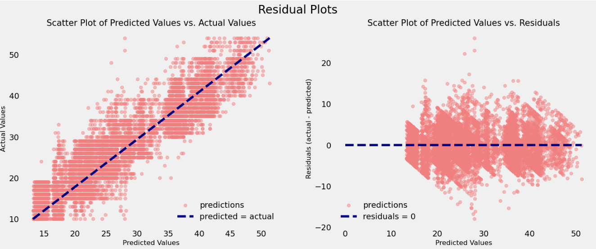

# 🍽️ Food Delivery Time Prediction

[](LICENSE)
[](https://www.python.org/)
[](https://jupyter.org/)


This project leverages machine learning techniques to predict food delivery times accurately. By analyzing various factors influencing delivery durations, it aims to enhance customer satisfaction and optimize logistics in the food delivery industry.

## 📊 Project Overview

The repository implements and compares several regression models, including:

- Linear Regression (Baseline)
- Random Forest Regressor
- XGBoost Regressor
- LightGBM Regressor

These models are trained and evaluated to determine the most effective approach for predicting delivery times.

## 🧠 Key Features

- 🧹 **Data Preprocessing**: Cleaning and preparing the dataset for modeling
- 🛠️ **Feature Engineering**: Generating relevant features to improve model performance
- 🧠 **Model Training**: Implementing multiple regression algorithms
- 🧪 **Evaluation**: Comparing model performance using appropriate metrics

## 🚀 Getting Started

### Prerequisites

- Python 3.x
- Jupyter Notebook

### Installation

1. Clone the repository:

   ```bash
   git clone https://github.com/davutbayik/food-delivery-time-prediction.git
   cd food-delivery-time-prediction

2. Create and activate a virtual environment (Optional-Recommended):

   ```bash
   python -m venv .venv
   source .venv/bin/activate  # On Windows: .venv\Scripts\activate

3. Install the required packages:
   ```bash
   pip install -r requirements.txt

4. Launch the Jupyter Notebook
   ```bash
   jupyter notebook food_delivery.ipynb

## 📈 Model Performance

To assess how well different models predict food delivery times, we evaluated them using:

- **Root Mean Squared Error (RMSE)**: Indicates how far predictions deviate from actual values. (Lower the better)
- **R-squared (R² Score)**: Explains how much variance in the target is captured by the model. (Higher the better)

## ✅ Model Comparison

| Model             | RMSE  | R² Score |
|------------------ |-------|----------|
| Linear Regression | 6.62  | 0.50     |
| Random Forest     | **3.92**  | **0.82**     |
| XGBoost           | 5.66  | 0.63     |
| LightGBM          | 4.13  | 0.81     |

## 🔍 Summary

- **Random Forest** achieved the best performance overall, slightly outperforming LightGBM in both accuracy and generalization.
- **LightGBM** was close behind, making them solid choices for robust modeling.
- **XGBoost** performed poorly unexpectedly, better hyperparameter tuning would leads to greater results.
- **Linear Regression** used as a baseline estimator, performed significantly worse, highlighting the non-linear complexity of the delivery time prediction problem.

The best-performing model showed promising results with high R² and low error values.

## 📉 Example Results

The image below shows how the residuals are distributed along the actual values by the best regressor.



## 🤝 Contributing

Contributions are welcome and appreciated! If you’d like to improve this project, here’s how you can help:

- 🐞 Report bugs or issues.
- 🌟 Suggest new features or improvements.
- 🔀 Fork the repo, make your changes, and submit a pull request.

Please make sure your code follows best practices and includes proper documentation where necessary.

## 📄 License

This project is licensed under the terms of the [MIT License](LICENSE).  
You are free to use, modify, and distribute this software as long as you include the original license.

## 📬 Contact

Made with ❤️ by [Davut Bayık](https://github.com/davutbayik) — feel free to reach out via GitHub for questions, feedback, or collaboration ideas.

---

⭐ If you found this project helpful, consider giving it a star!
